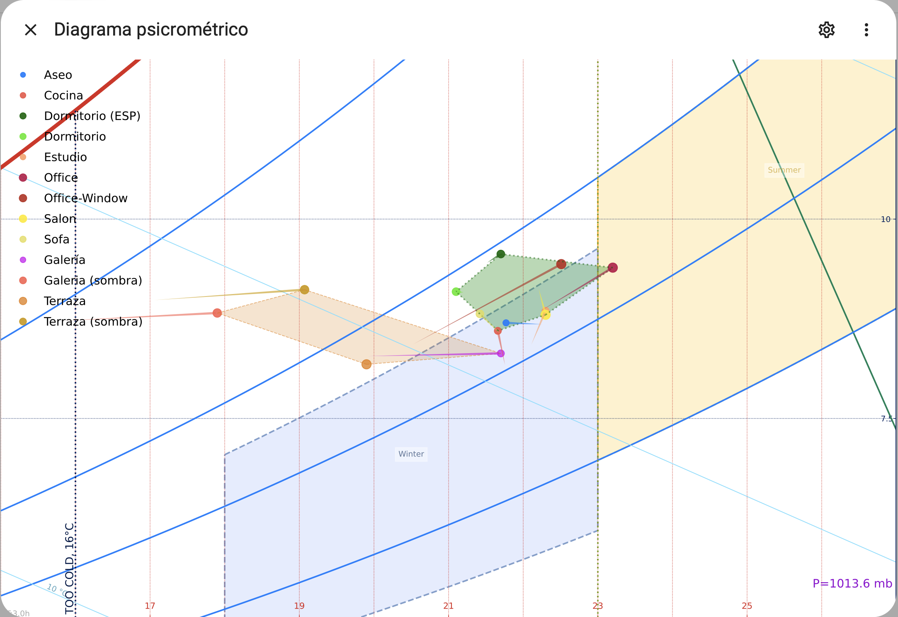

[![pre-commit.ci Status][pre-commit-ci-image]][pre-commit-ci-url]
[![Test Status][test-image]][test-url]
[![Build Status][build-image]][build-url]

<!-- Badges -->

[pre-commit-ci-image]: https://results.pre-commit.ci/badge/github/azogue/psychrochartweb/main.svg
[pre-commit-ci-url]: https://results.pre-commit.ci/latest/github/azogue/psychrochartweb/main
[test-image]: https://github.com/azogue/psychrochartweb/actions/workflows/run_tests.yml/badge.svg
[test-url]: https://github.com/azogue/psychrochartweb/actions/workflows/run_tests.yml
[build-image]: https://github.com/azogue/psychrochartweb/actions/workflows/main.yml/badge.svg
[build-url]: https://github.com/users/azogue/packages/container/package/psychrochartweb

[TOC]

# psychrochart-web

Web app to serve a customized [psychrochart](https://github.com/azogue/psychrochart) SVG for [HomeAssistant](https://www.home-assistant.io),
with annotated points from HA temperature and humidity sensors, to be used like a _webcam_



The SVG format enables _perfect definition_ for any pixel size showing the HomeAssistant _generic_ camera.

## Configuration

The app runs as a **docker container**, and expects some YAML configuration to set:

- The HomeAssistant host, and an **access token** to call its [API](https://developers.home-assistant.io/docs/api/rest/)
- A list of **'interior' and 'exterior' points**, each one linked to 2 sensor entities in HomeAssistant (one for temperature and other for humidity)
- Style attributes for each T-RH point (color, markersize, ...) and for the 2 groups of interior and exterior points, to draw them as **filled zones**, for quick **inspection of the psychrometric conditions inside and outside home**.

The config YAML file should look like this:

```yaml
homeassistant:
  # point to your HA
  host: http://ha-host-ip:8123
  token: LONG_LIVED_ACCESS_TOKEN

  # set constant altitude (in meters), OR point to some HA pressure sensor (in hPa / mbar)
  altitude: 7
  pressure_sensor: sensor.exterior_pressure

  # define temporal parameters
  delta_arrows: 10800 # plot arrows for each point, showing evolution of last 3h (3600s * 3 = 10800)
  scan_interval: 30 # desired update frequency for psychrochart regeneration

# list of sensor pairs (T_dry / RH) corresponding to measurements INSIDE home
interior:
  - name: Kitchen
    humidity: sensor.kitchen_humidity
    temperature: sensor.kitchen_temperature
    style:
      alpha: 0.9
      color: "#F15346"
      markersize: 9
  - name: Bedroom
    humidity: sensor.bedroom_humidity
    temperature: sensor.bedroom_temperature
    style:
      alpha: 0.9
      color: "#51E81F"
      markersize: 10
  - name: Bathroom
    humidity: sensor.bathroom_humidity
    temperature: sensor.bathroom_temperature
    style:
      color: "#3edffb"
      alpha: 0.9
      markersize: 8
  - name: Office
    humidity: sensor.office_humidity
    temperature: sensor.office_temperature
    style:
      alpha: 0.9
      color: "#bb2b1e"
      markersize: 12

# list of sensor pairs (T_dry / RH) corresponding to measurements OUTSIDE home
exterior:
  - name: Porch
    humidity: sensor.porch_humidity
    temperature: sensor.porch_temperature
    style:
      alpha: 0.7
      color: "#CE09F0"
      markersize: 9
  - name: Garden
    humidity: sensor.garden_humidity
    temperature: sensor.garden_temperature
    style:
      alpha: 0.7
      color: "#E37207"
      markersize: 12
  - name: Forecast
    temperature: sensor.dark_sky_temperature
    humidity: sensor.dark_sky_humidity
    style:
      alpha: 0.6
      color: "#7996BB"
      markersize: 7

# customize matplotlib styling for interior / exterior zones
interior_style_line:
  color: darkgreen
  lw: 2
  alpha: 0.5
  ls: ":"
interior_style_fill:
  color: green
  lw: 0
  alpha: 0.3
exterior_style_line:
  color: "#E37207"
  lw: 1
  alpha: 0.5
  ls: "--"
exterior_style_fill:
  color: "#E37207"
  lw: 0
  alpha: 0.2
```

## Install

1. Fill your own config based on the YAML above, or [this file](./src/psychrochartweb/config/default_ha.yaml)
2. Pull the latest image: `docker pull ghcr.io/azogue/psychrochartweb:main`
3. Run the container as daemon, mounting the folder with your config:

   ```shell
   docker run \
       --env HA_CONFIG_NAME=my_ha_sensors.yaml \
       --env CUSTOM_FOLDER=/app/custom \
       --env LOGGING_LEVEL=INFO \
       -v "`(pwd)`/custom:/app/custom" \
       -p "7778:8080/tcp" --rm --name psychrocam \
       -d ghcr.io/azogue/psychrochartweb:main
   ```

   That should serve the webapp in http://localhost:7778/docs, making available the psychrochart as SVG at http://localhost:7778/chart.svg

## Post-install: Camera in HomeAssistant

In HA, add a **'generic camera'** with the _still image url_ pointing to http://psychrocam-host-ip:7778/chart.svg, set a very low \_frame rate\* (1 or 2 Hz), and that's it 👌

## Development

To run tests or make changes, clone the repo and install the environment with **[`uv`](https://github.com/astral-sh/uv)** (from the creators of `ruff`: https://astral.sh)

```shell
# clone and install with uv
git clone https://github.com/azogue/psychrochartweb.git
cd psychrochartweb
uv venv
uv pip install -r pyproject.toml --all-extras -e .

# enable new virtual environment
source ./.venv/bin/activate

# and run tests / app / pre-commit
pre-commit install-hooks
pre-commit run --all-files
pytest
psychrocam
```

To edit your own configuration and build the docker image:

```shell
mkdir custom
cp src/psychrochartweb/config/default_ha.yaml custom/my_ha_sensors.yaml
# fill this file with your HA host + token, and your own HA entities
nano custom/my_ha_sensors.yaml

# build the docker image and run with compose
docker compose up -d
```
